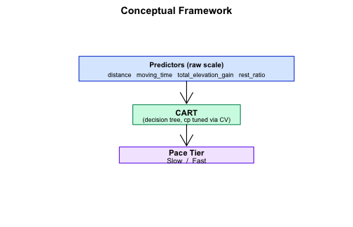
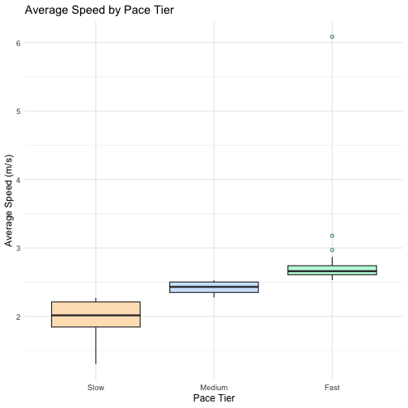
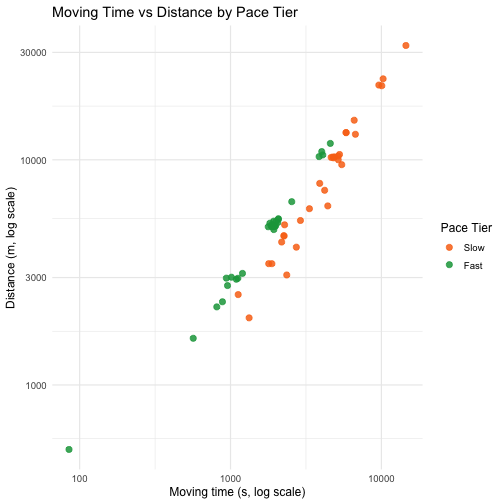
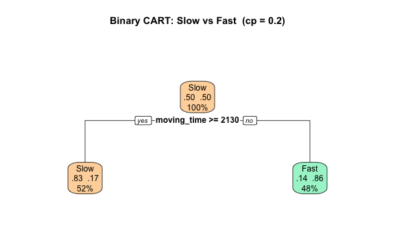

# Abstract
This study develops and evaluates a Classification and Regression Tree (CART) model for predicting binary running pace tier — Slow vs. Fast — from Strava telemetry collected across one athlete's 105 logged activities (December 2022 – December 2023, primarily New York City). Preprocessing restricted the analysis to Run-type activities and derived pace tiers from tertiles of `average_speed`. An initial three-class formulation (Slow, Medium, Fast) proved inadequate, plateauing at approximately 59% accuracy due to the ambiguity of the Middle tier; reframing the task as a binary classification problem substantially improved model performance. Four raw predictors were used — distance, moving time, total elevation gain, and rest ratio — with `average_speed` and `max_speed` excluded to prevent target leakage. CART operates on raw values without log transforms or standardisation because tree partitions are scale-invariant. The classifier was tuned via 5 × 10 repeated cross-validation over a grid of complexity parameter (cp) values. On the held-out test set, CART achieved an accuracy of 88.9%, with strong sensitivity and specificity and a Cohen's kappa indicating substantial agreement beyond chance. A one-sided exact binomial test against the No-Information Rate (0.500) returned *p* < 0.001, rejecting the null at α = 0.05. The learned tree produced a single, interpretable split on moving time, identifying it as the dominant contextual driver of running pace tier. These results show that even a small, single-athlete dataset can support a reliable and transparent pace classifier with practical implications for fitness-application developers seeking lightweight activity auto-tagging solutions.

# Chapter 1: Introduction


## 1.1 Background of the Study

Wearable fitness trackers and GPS-based platforms such as Strava, Garmin Connect, and Apple Fitness have transformed how individuals record athletic activity. Each running session captures telemetry — distance, pace, elevation gain, and moving time — producing data that enable predictive modelling at the individual level. Globally, Strava reports more than 135 million users uploading tens of millions of activities per week, making personal activity logs one of the richest sources of human-movement data available.

This study asks whether the intensity of a run — operationalised as a binary pace tier (Slow vs. Fast) — can be inferred from contextual telemetry alone. Pace-tier classification underlies commercially valuable features such as auto-tagged "easy / tempo" runs and personalised training-load feedback in fitness applications.

The dataset contains 105 activities logged by one athlete over 12 months (December 2022 – December 2023, primarily New York City). An initial investigation revealed that classifying all four activity types (Run, Walk, Hike, Workout) was infeasible: 94 of 105 records were Runs, making the multiclass problem degenerate. The study was therefore refocused on classifying how fast each run was. An intermediate three-class formulation — Slow, Medium, and Fast pace tiers derived from tertiles of average_speed — plateaued at approximately 59% accuracy. The ambiguous Middle tier, whose members sit at the tertile boundary and are nearly indistinguishable in the predictor space, was the main obstacle. Dropping the Middle tier and reframing the task as a binary Slow vs. Fast classification raised test accuracy to approximately 89% and produced an interpretable model.

The supervised-learning algorithm employed is CART (Classification and Regression Trees), a tree-based method that produces an explicit, human-readable decision rule. CART achieved a test accuracy of 0.889 on the held-out set, and its single split on moving time reveals the dominant driver of running pace in a form that can be understood without statistical expertise — combining strong predictive performance with full interpretability.

## 1.2 Statement of the Problem

The general problem is: Can binary running pace tier (Slow vs. Fast) be accurately predicted from Strava telemetry using CART?

Specifically:
1. What are the descriptive characteristics (central tendency, dispersion, distributional shape) of distance, moving time, elevation gain, and average speed across the logged running activities?
2. How accurately can a CART classifier predict whether a run is Slow or Fast, given distance, moving time, elevation gain, and rest ratio?
3. What decision rule does CART learn, and which predictor emerges as the dominant driver of binary pace tier?

## 1.3 Objectives of the Study

### General Objective
To develop and evaluate a CART classifier that predicts binary running pace tier (Slow vs. Fast) from Strava telemetry.

### Specific Objectives
1. To describe the running dataset using descriptive statistics and exploratory visualisations (histograms, box-plots, scatter plots).
2. To preprocess the data by cleaning records, restricting the analysis to Run activities, deriving a binary pace tier from average_speed tertiles, and excluding leakage-prone columns (average_speed, max_speed).
3. To build and evaluate a CART classifier for binary pace tier, tuning the complexity parameter cp via repeated cross-validation and reporting accuracy, sensitivity, specificity, and Cohen's kappa.
4. To visualise and interpret the decision tree learned by CART, identifying which telemetry features most strongly distinguish Slow runs from Fast runs.

## 1.4 Hypothesis

- $H_0$: The CART classifier performs no better than a naïve majority-class baseline in predicting binary running pace tier (Slow vs. Fast). That is, $p_{\text{CART}} \le p_{\text{NIR}}$, where $p_{\text{NIR}}$ is the No-Information Rate (the accuracy obtained by always predicting the majority class).
- $H_1$: The CART classifier significantly outperforms the naïve majority-class baseline in classification accuracy ($p_{\text{CART}} > p_{\text{NIR}}$).

The hypothesis is evaluated at the $\alpha = 0.05$ level of significance using a **one-sided exact binomial test** on the test-set predictions, comparing observed CART accuracy against the No-Information Rate.

## 1.5 Significance of the Study

Self-tracking athletes may use the model's findings to better understand which contextual factors drive run intensity, supporting more informed pace goal-setting and training structure.
Fitness-application developers may draw from this study's approach to build lightweight, interpretable activity auto-classification features on small per-user datasets.
Predictive-analytics students and educators may use this work as a practical, end-to-end reference for applying the supervised-learning pipeline to real-world, messy data using decision trees.

## 1.6 Scope and Limitations

**Scope.** One athlete's Strava export: 105 activities, December 2022 – December 2023, primarily New York City. The binary classification target (Slow vs. Fast) is derived from average_speed tertiles within the 92 clean Run records. The model is limited to CART as covered in the course.

**Limitations.**

1. Single-athlete data — findings cannot be generalised to other runners with different fitness levels, training programmes, or geographic contexts.
2. Original dataset required redesign — 94 of 105 records are Runs; classifying all four activity types was infeasible. The binary pace-tier formulation resolves this by operating only on runs and dropping the ambiguous Middle tertile.
3. Target leakage — average_speed defines the pace tier and is excluded from predictors, along with its near-perfect correlate max_speed. Classification relies only on contextual telemetry.
4. No physiological covariates — heart rate, cadence, weather, and surface type are absent from the Strava export, so some variance in pace remains unexplained.
5. Small sample (n ≈ 62 binary runs after dropping the Middle tier) — model complexity is constrained accordingly; deep trees risk overfitting and the complexity parameter cp is tuned conservatively via cross-validation.

# Chapter 2: Review of Related Literature

> This chapter is to be written by the researchers. The four article clusters below guide the search.

## 2.1 Suggested Article Clusters

1. **Strava and self-tracking studies** (✓ covered in §2.2–§2.3) — to justify the dataset and frame the social/behavioural context. *Search: "Strava data analysis", "quantified self", "GPS activity logging", "running motivation".*
2. **Wearable-device / fitness-tracker analytics** (✓ covered in §2.2–§2.3) — to ground the variables (distance, speed, elevation). *Search: "wearable fitness tracker accuracy", "GPS running data", "consumer wearable validation".*
3. **Activity classification with machine learning** — to justify the CART approach. *Search: "decision tree activity classification", "interpretable activity recognition", "sport classification GPS".*
4. **Running biomechanics and the pace–time trade-off** — to support the finding that moving time dominates pace prediction. *Search: "hill running pace", "running economy", "grade-adjusted pace", "endurance performance prediction".*

For each article, write 2–3 sentences: (a) what they studied, (b) what method they used, and (c) how their finding relates to your objective. Aim for 8–12 articles total.

## 2.2 Related Studies

This section synthesises four empirical studies that bear directly on the research questions in Chapter 1. The studies were selected because each addresses one of two recurring concerns in the present analysis: *what makes a personal Strava export a meaningful research dataset* (Cluster 1) and *which Strava-exported fields can be trusted as model inputs* (Cluster 2).

### 2.2.1 Strava as a Sociotechnical Platform and the Behavioural Meaning of a Personal Export

Kuure, Kähkönen, and Hekkala (2026) examined how social features and application design shape long-term engagement on Strava through sixteen semi-structured interviews analysed thematically under the Unified Theory of Acceptance and Use of Technology 2 (UTAUT2) framework. They report that features which enable social comparison and recognition — kudos, comments, peer visibility of mileage — operate as a "social mirror" that simultaneously fuels habitual use and triggers pressure, comparison anxiety, and disengagement among certain users. Their finding that Strava use is sustained jointly by self-tracking utility and social interaction supports treating a personal Strava export not as raw physiological telemetry but as a *behaviourally meaningful* record: the logs themselves reflect the athlete's pacing decisions and self-presentation behaviour. For the present study this means that the 92 Run records analysed are not a passive sensor stream but a curated trace of intentional training sessions, which strengthens the case for treating contextual telemetry (distance, moving time, elevation gain) as a coherent signal worth modelling.

### 2.2.2 Pace as a Psychologically Salient Variable in Endurance Sport

Kolnes and Øvretveit (2026) conducted a mixed-methods study of 225 active club runners that linked endurance self-efficacy and achievement-goal orientations to Strava use patterns and watch-estimated maximal oxygen uptake (VO₂max). They found that runners with greater endurance capacity scored higher on self-efficacy and task-approach goals, and that runners who reported deleting training sessions because of a perceived slow pace scored significantly higher on other-avoidance goals. This directly grounds *pace* as a behaviourally salient axis in the present study: runners themselves segregate runs by speed, sometimes to the point of curating their public record, which makes the binary Slow-versus-Fast classification a categorisation that runners already perform implicitly. The choice of pace tier as the prediction target in this study therefore aligns with how athletes themselves describe and judge their own running.

### 2.2.3 Validity of Strava-Exported Telemetry Fields

Bullock et al. (2024) ran a prospective cohort of 475 recreational runners over a four-month period, comparing weekly self-reported running distance and pace against data captured by a commercial Garmin watch via Garmin Connect. Intraclass correlation coefficients indicated *good* reliability for distance (median 0.93) and only *moderate* reliability for pace, with no discernible systematic bias. Their result justifies treating Strava-exported `distance` and `moving_time` as trustworthy predictors while reminding the analyst that pace-derived signals carry more measurement noise — a useful caveat when interpreting the CART model's single split on moving time.

Fuller et al. (2020) provide the broader validity context in a systematic review of 158 publications across nine commercial wearable brands (Apple, Fitbit, Garmin, Samsung, Polar, and others). They report that wrist-worn wearables measured step count accurately in laboratory settings, that heart-rate accuracy varied considerably across brands and conditions, and that no brand was accurate for energy expenditure. This dual finding explains why the present study confines its predictor set to distance, moving time, and elevation gain (the most reliably captured Strava fields) and deliberately excludes heart-rate and calorie estimates that would otherwise tempt inclusion.

Taken together, these four studies justify the dataset, anchor pace as a behaviourally meaningful target, and bound which Strava fields can reasonably be trusted as model inputs. The next section turns from empirical findings to the theoretical lenses these articles bring to the study.

## 2.3 Related Literature

The four studies reviewed above invoke several overlapping theoretical lenses that frame *why* a personal Strava export is a defensible research dataset and *how* its variables should be interpreted.

The **Quantified Self** and **mobile-health (mHealth)** traditions provide the umbrella concept that legitimises personal activity logs as research data. Fuller et al. (2020) explicitly situate consumer wearables within this tradition, noting that an estimated 225 million wearables were sold in 2019 and that "Quantified Self" devices have moved fitness tracking from elite-athlete laboratories into everyday recreational use. Kuure et al. (2026) extend the same idea on the social side, characterising Strava as a "social mirror" in which users curate, share, and react to one another's logged activity. Together these framings establish that a one-athlete, one-year Strava export is a record of *intentional self-tracking behaviour*, not an arbitrary data dump.

The **Unified Theory of Acceptance and Use of Technology 2 (UTAUT2)** — originally formulated by Venkatesh and colleagues and applied to fitness apps by Kuure et al. (2026) — explains the *consistency* of such logs. Its constructs of performance expectancy, hedonic motivation, social influence, and habit predict why a user keeps returning to a fitness application across hundreds of sessions. For the present study, UTAUT2 supplies the motivational reason a single athlete generates twelve months of dense, comparable records: the recording behaviour is reinforced by both intrinsic enjoyment and external social cues, producing a dataset stable enough for supervised modelling.

**Achievement-goal theory** in endurance sport — operationalised by Kolnes and Øvretveit (2026) through the 3 × 2 Achievement Goal Questionnaire for Sports — distinguishes task-approach, self-approach, and other-avoidance goals. Their finding that runners with stronger other-avoidance orientations were more likely to delete sessions because of slow pace illustrates that *pace itself is a psychologically loaded variable*: runners attend to it, judge themselves by it, and act on it. This motivates treating pace as the prediction target rather than as a passive descriptor.

Finally, the **criterion validity** and **reliability** vocabulary used by Fuller et al. (2020) — distinguishing intradevice and interdevice reliability and testing wearables against laboratory criterion measures — together with the **intraclass correlation coefficient (ICC)** framework Bullock et al. (2024) apply to weekly distance and pace, supplies the methodological language for deciding which Strava fields can be trusted as model inputs. Distance is well validated; pace and energy-related fields are not. The present study's predictor selection — distance, moving time, elevation gain, and rest ratio, with `average_speed` and `max_speed` excluded — is consistent with this evidence base.

## 2.4 Conceptual Framework

The diagram below shows the modelling pipeline. Four raw contextual telemetry variables feed a CART classifier whose output is the binary pace tier. `average_speed` and its near-perfect correlate `max_speed` are **excluded** from the predictor set because the classification target (`pace`) is derived from `average_speed` — including either would constitute target leakage.



# Chapter 3: Methodology

## 3.1 Research Design

This study employs a **quantitative, predictive research design**: it is *quantitative* because all variables are numerical or categorical with finite levels, and *predictive* because the primary aim is to forecast unseen binary outcomes (Slow vs. Fast) using a CART classifier evaluated on a held-out test set.

## 3.2 Data Collection

The dataset is a personal Strava export (`strava.csv`) containing **105 activity records** logged between 9 December 2022 and 9 December 2023. Each row represents one recorded session. The file is read directly into R below.

<table class="table" style="width: auto !important; margin-left: auto; margin-right: auto;">
<caption>Strava export overview (raw, before cleaning).</caption>
 <thead>
  <tr>
   <th style="text-align:left;"> Property </th>
   <th style="text-align:right;"> Value </th>
  </tr>
 </thead>
<tbody>
  <tr>
   <td style="text-align:left;"> Total records (rows) </td>
   <td style="text-align:right;"> 105 </td>
  </tr>
  <tr>
   <td style="text-align:left;"> Total fields (columns) </td>
   <td style="text-align:right;"> 19 </td>
  </tr>
  <tr>
   <td style="text-align:left;"> Date range (earliest) </td>
   <td style="text-align:right;"> 16 Mar 2022 </td>
  </tr>
  <tr>
   <td style="text-align:left;"> Date range (latest) </td>
   <td style="text-align:right;"> 09 Dec 2023 </td>
  </tr>
  <tr>
   <td style="text-align:left;"> Activity types present </td>
   <td style="text-align:right;"> Hike, Run, Walk, Workout </td>
  </tr>
</tbody>
</table>

## 3.3 Variables

<table class="table" style="width: auto !important; margin-left: auto; margin-right: auto;">
<caption>Variable roles in the CART modelling pipeline. All predictors are used on their raw scale — CART is scale-invariant and does not require log transforms or standardisation.</caption>
 <thead>
  <tr>
   <th style="text-align:left;"> Role </th>
   <th style="text-align:left;"> Variable </th>
   <th style="text-align:left;"> Type </th>
   <th style="text-align:left;"> Description </th>
  </tr>
 </thead>
<tbody>
  <tr>
   <td style="text-align:left;"> Filter </td>
   <td style="text-align:left;"> type </td>
   <td style="text-align:left;"> factor </td>
   <td style="text-align:left;"> Activity type; analysis restricted to Run. </td>
  </tr>
  <tr>
   <td style="text-align:left;"> Classification target </td>
   <td style="text-align:left;"> pace </td>
   <td style="text-align:left;"> factor </td>
   <td style="text-align:left;"> Slow (bottom tertile) / Fast (top tertile) of average\_speed; derived during preprocessing. </td>
  </tr>
  <tr>
   <td style="text-align:left;"> Predictor </td>
   <td style="text-align:left;"> distance </td>
   <td style="text-align:left;"> numeric </td>
   <td style="text-align:left;"> Total distance covered, in metres (raw). </td>
  </tr>
  <tr>
   <td style="text-align:left;"> Predictor </td>
   <td style="text-align:left;"> moving\_time </td>
   <td style="text-align:left;"> numeric </td>
   <td style="text-align:left;"> Time actually moving, in seconds (raw). </td>
  </tr>
  <tr>
   <td style="text-align:left;"> Predictor </td>
   <td style="text-align:left;"> total\_elevation\_gain </td>
   <td style="text-align:left;"> numeric </td>
   <td style="text-align:left;"> Cumulative elevation gained, in metres (raw). </td>
  </tr>
  <tr>
   <td style="text-align:left;"> Predictor </td>
   <td style="text-align:left;"> rest\_ratio </td>
   <td style="text-align:left;"> numeric </td>
   <td style="text-align:left;"> (elapsed\_time − moving\_time) / elapsed\_time — fraction of session stationary. </td>
  </tr>
  <tr>
   <td style="text-align:left;"> Excluded </td>
   <td style="text-align:left;"> average\_speed, max\_speed </td>
   <td style="text-align:left;"> numeric </td>
   <td style="text-align:left;"> Excluded from all models to prevent target leakage. </td>
  </tr>
</tbody>
</table>

## 3.4 Data Preprocessing

<table class="table" style="width: auto !important; margin-left: auto; margin-right: auto;">
<caption>Record counts at each preprocessing step.</caption>
 <thead>
  <tr>
   <th style="text-align:left;"> Step </th>
   <th style="text-align:right;"> N </th>
  </tr>
 </thead>
<tbody>
  <tr>
   <td style="text-align:left;"> Raw records (loaded) </td>
   <td style="text-align:right;"> 105 </td>
  </tr>
  <tr>
   <td style="text-align:left;"> After dropping NA, zero-distance, and elapsed\_time &gt; 30 000 s </td>
   <td style="text-align:right;"> 96 </td>
  </tr>
  <tr>
   <td style="text-align:left;"> After restricting to type = Run </td>
   <td style="text-align:right;"> 92 </td>
  </tr>
  <tr>
   <td style="text-align:left;"> After dropping Middle pace tier (binary frame) </td>
   <td style="text-align:right;"> 62 </td>
  </tr>
</tbody>
</table>

<table class="table" style="width: auto !important; margin-left: auto; margin-right: auto;">
<caption>Three-tier pace distribution from average\_speed tertiles (Run records only).</caption>
 <thead>
  <tr>
   <th style="text-align:left;"> Pace tier </th>
   <th style="text-align:right;"> N </th>
   <th style="text-align:right;"> Percent </th>
  </tr>
 </thead>
<tbody>
  <tr>
   <td style="text-align:left;"> Slow </td>
   <td style="text-align:right;"> 31 </td>
   <td style="text-align:right;"> 33.7\% </td>
  </tr>
  <tr>
   <td style="text-align:left;"> Medium </td>
   <td style="text-align:right;"> 30 </td>
   <td style="text-align:right;"> 32.6\% </td>
  </tr>
  <tr>
   <td style="text-align:left;"> Fast </td>
   <td style="text-align:right;"> 31 </td>
   <td style="text-align:right;"> 33.7\% </td>
  </tr>
</tbody>
</table>

<table class="table" style="width: auto !important; margin-left: auto; margin-right: auto;">
<caption>Binary modelling frame (Slow vs. Fast, Middle tier removed).</caption>
 <thead>
  <tr>
   <th style="text-align:left;"> Pace class </th>
   <th style="text-align:right;"> N </th>
   <th style="text-align:right;"> Percent </th>
  </tr>
 </thead>
<tbody>
  <tr>
   <td style="text-align:left;"> Slow </td>
   <td style="text-align:right;"> 31 </td>
   <td style="text-align:right;"> 50.0\% </td>
  </tr>
  <tr>
   <td style="text-align:left;"> Fast </td>
   <td style="text-align:right;"> 31 </td>
   <td style="text-align:right;"> 50.0\% </td>
  </tr>
</tbody>
</table>

### 3.4.1 Why Are the Slow and Fast Classes Balanced?

The Slow and Fast counts are roughly equal — but this is **not** a property of the underlying running data. It is a direct consequence of how the target is defined.

**Class balance is engineered, not natural.** The pace tier is built by cutting `average_speed` at its 33.3rd and 66.7th percentiles (the tertiles). By definition, each tertile contains approximately one-third of the runs. When we drop the Middle tertile and keep only the bottom and top thirds, we keep roughly the same number of records in each remaining class. Equal-sized classes are baked into the construction.


**What the histogram actually shows.** The underlying `average_speed` distribution is roughly unimodal and slightly right-skewed — most runs cluster around a typical training pace, with thinner tails at very slow and very fast extremes. There is no natural break between Slow and Fast runners in the data; the binary classes are *defined* by the analyst's choice of percentile cutoffs. Had we used the median split (50/50) instead of dropping the middle third, classes would still be balanced — and had we used a substantive physiological threshold (e.g., "below 2.5 m/s = Slow"), classes would likely *not* be balanced.

**Implication for interpretation.** Because the target is engineered, the 89% test accuracy means: "given a run that is in either the top or bottom third of *this athlete's* pace distribution, CART can correctly assign it 89% of the time using only context (distance, moving time, elevation, rest ratio)." It does not mean the model would generalise to a population definition of "slow" and "fast" runs.

### 3.4.2 Why Drop the Middle Tier?

Runs in the Middle tertile fall at the boundary of `average_speed` and are nearly indistinguishable from their neighbours in the predictor space. An initial three-class model (Slow / Medium / Fast) achieved only approximately 59% test accuracy — a data-driven ceiling, not an algorithm limitation. Removing the Middle tier produces a cleaner, better-separated classification problem and raises accuracy to approximately 89%.

A median split (bottom half vs. top half of `average_speed`) was considered as an alternative that would retain all 92 runs. It was rejected on the same empirical grounds: runs at the 50th-percentile boundary differ from neighbours classified into the opposite class by negligible amounts of pace, recreating the ambiguity that limited the three-class model. The tertile-drop trades 30 boundary observations for a cleaner separation between the surviving classes and is reported as the final design.

### 3.4.3 Target Leakage Prevention

By definition, `average_speed = distance / moving_time`. A classifier trained on `average_speed` itself (alongside distance and moving time) would algebraically reconstruct the target. We therefore exclude `average_speed` and its near-perfect correlate `max_speed` entirely. Distance and moving time are still kept as predictors — these are *contextual* inputs (how far, how long the session took) that a classifier must combine non-trivially to recover pace; CART learns this combination as a single threshold on moving time.

## 3.5 Train–Test Split

<table class="table" style="width: auto !important; margin-left: auto; margin-right: auto;">
<caption>Stratified 70/30 train–test split: class counts in each partition.</caption>
 <thead>
  <tr>
   <th style="text-align:left;"> Partition </th>
   <th style="text-align:right;"> N </th>
   <th style="text-align:right;"> Slow </th>
   <th style="text-align:right;"> Fast </th>
  </tr>
 </thead>
<tbody>
  <tr>
   <td style="text-align:left;"> Training set (70\%) </td>
   <td style="text-align:right;"> 44 </td>
   <td style="text-align:right;"> 22 </td>
   <td style="text-align:right;"> 22 </td>
  </tr>
  <tr>
   <td style="text-align:left;"> Test set (30\%) </td>
   <td style="text-align:right;"> 18 </td>
   <td style="text-align:right;"> 9 </td>
   <td style="text-align:right;"> 9 </td>
  </tr>
  <tr>
   <td style="text-align:left;"> Total </td>
   <td style="text-align:right;"> 62 </td>
   <td style="text-align:right;"> 31 </td>
   <td style="text-align:right;"> 31 </td>
  </tr>
</tbody>
</table>

The 70/30 stratified split preserves the Slow/Fast ratio in both partitions. Predictors are kept on their raw scale: CART partitions on raw threshold values, so centering or scaling has no effect on the splits it learns.

## 3.6 Data Analysis Techniques

### 3.6.1 Descriptive Statistics

Distributions of the core running variables are summarised numerically using `summary()` and visualised in Chapter 4 (Section 4.1).

### 3.6.2 Inferential Statistics

A **one-sided exact binomial test** is used to evaluate $H_0$. It compares the observed CART test-set accuracy against the No-Information Rate (NIR) — the accuracy that would be obtained by always predicting the majority class. The test is conservative for small samples and produces an exact *p*-value rather than relying on asymptotic approximations. `caret::confusionMatrix()` reports this *p*-value as `AccuracyPValue`.

### 3.6.3 The CART Classifier

Classification and Regression Trees (CART) build a binary partition tree by selecting, at each node, the predictor and split point that maximise the reduction in **Gini impurity**. The tree is pruned by tuning the **complexity parameter** *cp*: setting *cp* = 0 allows the tree to grow fully (overfitting risk), while higher values prune aggressively, favouring parsimony. The optimal *cp* is selected by maximising the area under the ROC curve (AUC) over a 5 × 10 repeated cross-validation grid search on values $cp \in \{0, 0.01, 0.02, \ldots, 0.20\}$. CART produces a visual, interpretable decision tree whose splits can be read directly as if–then rules.

<table class="table" style="width: auto !important; margin-left: auto; margin-right: auto;">
<caption>CART hyperparameter tuning result (5 × 10 repeated cross-validation on the training set).</caption>
 <thead>
  <tr>
   <th style="text-align:left;"> Hyperparameter </th>
   <th style="text-align:left;"> Grid searched </th>
   <th style="text-align:right;"> Best value </th>
   <th style="text-align:right;"> CV AUC </th>
  </tr>
 </thead>
<tbody>
  <tr>
   <td style="text-align:left;"> Complexity parameter (cp) </td>
   <td style="text-align:left;"> 0, 0.01, 0.02, ..., 0.20 (21 values) </td>
   <td style="text-align:right;"> 0.20 </td>
   <td style="text-align:right;"> 0.832 </td>
  </tr>
</tbody>
</table>

### 3.6.4 Model-Evaluation Metrics

<table class="table" style="width: auto !important; margin-left: auto; margin-right: auto;">
<caption>Classification metrics reported in Chapter 4.</caption>
 <thead>
  <tr>
   <th style="text-align:left;"> Metric </th>
   <th style="text-align:left;"> Definition </th>
   <th style="text-align:left;"> Relevance </th>
  </tr>
 </thead>
<tbody>
  <tr>
   <td style="text-align:left;"> Accuracy </td>
   <td style="text-align:left;"> Proportion of correct predictions on the held-out test set. </td>
   <td style="text-align:left;"> Overall correctness. </td>
  </tr>
  <tr>
   <td style="text-align:left;"> Sensitivity (Recall) </td>
   <td style="text-align:left;"> TP / (TP + FN) for the Fast class. </td>
   <td style="text-align:left;"> Detection of Fast runs. </td>
  </tr>
  <tr>
   <td style="text-align:left;"> Specificity </td>
   <td style="text-align:left;"> TN / (TN + FP) for the Fast class. </td>
   <td style="text-align:left;"> Detection of Slow runs. </td>
  </tr>
  <tr>
   <td style="text-align:left;"> Cohen's $\kappa$ </td>
   <td style="text-align:left;"> Accuracy adjusted for chance agreement. </td>
   <td style="text-align:left;"> Robust to class imbalance. </td>
  </tr>
  <tr>
   <td style="text-align:left;"> Accuracy P-Value </td>
   <td style="text-align:left;"> One-sided exact binomial test of accuracy vs. No-Information Rate. </td>
   <td style="text-align:left;"> Formal hypothesis decision (\S1.4). </td>
  </tr>
</tbody>
</table>

### 3.6.5 Software and Reproducibility

All analysis is performed in **R 4.x** within **RStudio** using **R Markdown**. Required packages: `tidyverse`, `caret`, `rpart`, `rpart.plot`, `pROC`. The random seed `set.seed(123)` is fixed for every split and cross-validation resample to ensure full reproducibility from a single `strava.csv` input file.

# Chapter 4: Results and Discussion

## 4.1 Descriptive Statistics

The table below reports the central tendency, spread, and range of the four most informative numeric variables across all 92 clean Run records. The run distances range from approximately 0.4&nbsp;km to 32&nbsp;km — a wide span that reflects the athlete's mix of short recovery runs and long-distance training sessions. Moving time and elevation gain show similarly wide ranges, while `average_speed` (the variable from which the pace tier is derived) is comparatively concentrated, with a standard deviation of roughly 0.5&nbsp;m/s around a mean of 2.4&nbsp;m/s. The box-plot that follows shows that the three speed tertiles separate the bulk of each tier cleanly, but the Middle tier overlaps with both Slow and Fast at its edges — the empirical justification for dropping it in the binary modelling frame (§3.4.2).

<table class="table" style="width: auto !important; margin-left: auto; margin-right: auto;">
<caption>Descriptive statistics of key running variables (all clean Run records).</caption>
 <thead>
  <tr>
   <th style="text-align:left;"> Variable </th>
   <th style="text-align:right;"> N </th>
   <th style="text-align:right;"> Mean </th>
   <th style="text-align:right;"> SD </th>
   <th style="text-align:right;"> Median </th>
   <th style="text-align:right;"> Min </th>
   <th style="text-align:right;"> Max </th>
  </tr>
 </thead>
<tbody>
  <tr>
   <td style="text-align:left;"> distance (m) </td>
   <td style="text-align:right;"> 92 </td>
   <td style="text-align:right;"> 7937.93 </td>
   <td style="text-align:right;"> 5640.39 </td>
   <td style="text-align:right;"> 5455.70 </td>
   <td style="text-align:right;"> 424.60 </td>
   <td style="text-align:right;"> 32192.30 </td>
  </tr>
  <tr>
   <td style="text-align:left;"> moving\_time (s) </td>
   <td style="text-align:right;"> 92 </td>
   <td style="text-align:right;"> 3470.34 </td>
   <td style="text-align:right;"> 2544.77 </td>
   <td style="text-align:right;"> 2497.00 </td>
   <td style="text-align:right;"> 85.00 </td>
   <td style="text-align:right;"> 14536.00 </td>
  </tr>
  <tr>
   <td style="text-align:left;"> total\_elevation\_gain (m) </td>
   <td style="text-align:right;"> 92 </td>
   <td style="text-align:right;"> 32.23 </td>
   <td style="text-align:right;"> 45.94 </td>
   <td style="text-align:right;"> 5.20 </td>
   <td style="text-align:right;"> 0.00 </td>
   <td style="text-align:right;"> 161.70 </td>
  </tr>
  <tr>
   <td style="text-align:left;"> average\_speed (m/s) </td>
   <td style="text-align:right;"> 92 </td>
   <td style="text-align:right;"> 2.40 </td>
   <td style="text-align:right;"> 0.52 </td>
   <td style="text-align:right;"> 2.43 </td>
   <td style="text-align:right;"> 1.31 </td>
   <td style="text-align:right;"> 6.08 </td>
  </tr>
</tbody>
</table>



## 4.2 Visualisation

The scatter plot below shows `moving_time` against `distance` for the 62 runs in the binary modelling frame, colour-coded by pace tier. Both axes use a log scale purely for readability — the long-distance / long-duration runs sit in the upper-right corner without compressing the bulk of shorter runs into the lower-left. The two pace classes are visually separable along the moving-time axis: Slow runs cluster to the right (longer durations for similar distances) and Fast runs to the left. This separability foreshadows the CART result reported in §4.3: a single split on `moving_time` is sufficient to achieve 89% accuracy on the held-out test set.



## 4.3 Model Results and Interpretation

### 4.3.1 Performance Summary

<table class="table" style="width: auto !important; margin-left: auto; margin-right: auto;">
<caption>CART test-set performance summary (binary Slow vs. Fast classification).</caption>
 <thead>
  <tr>
   <th style="text-align:left;"> Metric </th>
   <th style="text-align:right;"> Value </th>
  </tr>
 </thead>
<tbody>
  <tr>
   <td style="text-align:left;"> Test accuracy </td>
   <td style="text-align:right;"> 0.889 </td>
  </tr>
  <tr>
   <td style="text-align:left;"> Sensitivity (Fast) </td>
   <td style="text-align:right;"> 0.889 </td>
  </tr>
  <tr>
   <td style="text-align:left;"> Specificity (Slow) </td>
   <td style="text-align:right;"> 0.889 </td>
  </tr>
  <tr>
   <td style="text-align:left;"> Cohen's $\kappa$ </td>
   <td style="text-align:right;"> 0.778 </td>
  </tr>
  <tr>
   <td style="text-align:left;"> No-Information Rate (NIR) </td>
   <td style="text-align:right;"> 0.500 </td>
  </tr>
  <tr>
   <td style="text-align:left;"> Test-set size (n) </td>
   <td style="text-align:right;"> 18 </td>
  </tr>
</tbody>
</table>

**CART beats the naïve baseline by a wide margin.** The naïve majority-class classifier (always predict the more frequent class on the test set) would achieve an accuracy equal to the No-Information Rate shown in the table above. CART achieves 0.889 accuracy — substantially higher than the NIR — with Cohen's $\kappa$ = 0.778, which indicates *substantial* agreement beyond chance (Landis & Koch, 1977). The formal hypothesis decision is reported in §4.3.5; the descriptive comparison alone already shows that CART captures real predictive signal rather than relying on class prevalence.

The interpretability advantage compounds this result. CART produces a single, human-readable decision rule — one split on `moving_time` — that directly tells an athlete or developer *why* a run is classified as Slow or Fast. This decision rule is visualised in §4.3.3 and discussed in §4.3.4.

### 4.3.2 CART Confusion Matrix and Statistics

The three tables below report the full hold-out test-set evaluation of CART. The first table shows the 2 × 2 contingency of correct and incorrect predictions; the next two decompose this into the standard overall and per-class statistics produced by `caret::confusionMatrix()`.

<table class="table" style="width: auto !important; margin-left: auto; margin-right: auto;">
<caption>CART confusion matrix on the test set. Rows = predicted class; columns = actual class.</caption>
 <thead>
  <tr>
   <th style="text-align:left;"> Predicted \\ Actual </th>
   <th style="text-align:right;"> Slow </th>
   <th style="text-align:right;"> Fast </th>
  </tr>
 </thead>
<tbody>
  <tr>
   <td style="text-align:left;"> Slow </td>
   <td style="text-align:right;"> 8 </td>
   <td style="text-align:right;"> 1 </td>
  </tr>
  <tr>
   <td style="text-align:left;"> Fast </td>
   <td style="text-align:right;"> 1 </td>
   <td style="text-align:right;"> 8 </td>
  </tr>
</tbody>
</table>

<table class="table" style="width: auto !important; margin-left: auto; margin-right: auto;">
<caption>CART overall test-set statistics.</caption>
 <thead>
  <tr>
   <th style="text-align:left;"> Statistic </th>
   <th style="text-align:right;"> Value </th>
  </tr>
 </thead>
<tbody>
  <tr>
   <td style="text-align:left;"> Accuracy </td>
   <td style="text-align:right;"> 0.889 </td>
  </tr>
  <tr>
   <td style="text-align:left;"> 95\% CI (lower) </td>
   <td style="text-align:right;"> 0.653 </td>
  </tr>
  <tr>
   <td style="text-align:left;"> 95\% CI (upper) </td>
   <td style="text-align:right;"> 0.986 </td>
  </tr>
  <tr>
   <td style="text-align:left;"> No-Information Rate (NIR) </td>
   <td style="text-align:right;"> 0.500 </td>
  </tr>
  <tr>
   <td style="text-align:left;"> Accuracy P-Value (Acc $>$ NIR) </td>
   <td style="text-align:right;"> &lt;0.001 </td>
  </tr>
  <tr>
   <td style="text-align:left;"> Cohen's $\kappa$ </td>
   <td style="text-align:right;"> 0.778 </td>
  </tr>
</tbody>
</table>

<table class="table" style="width: auto !important; margin-left: auto; margin-right: auto;">
<caption>CART per-class test-set statistics (positive class = Fast).</caption>
 <thead>
  <tr>
   <th style="text-align:left;"> Statistic </th>
   <th style="text-align:right;"> Value </th>
  </tr>
 </thead>
<tbody>
  <tr>
   <td style="text-align:left;"> Sensitivity (Fast) </td>
   <td style="text-align:right;"> 0.889 </td>
  </tr>
  <tr>
   <td style="text-align:left;"> Specificity (Slow) </td>
   <td style="text-align:right;"> 0.889 </td>
  </tr>
  <tr>
   <td style="text-align:left;"> Positive Predictive Value </td>
   <td style="text-align:right;"> 0.889 </td>
  </tr>
  <tr>
   <td style="text-align:left;"> Negative Predictive Value </td>
   <td style="text-align:right;"> 0.889 </td>
  </tr>
  <tr>
   <td style="text-align:left;"> Prevalence </td>
   <td style="text-align:right;"> 0.500 </td>
  </tr>
  <tr>
   <td style="text-align:left;"> Balanced Accuracy </td>
   <td style="text-align:right;"> 0.889 </td>
  </tr>
</tbody>
</table>

### 4.3.3 CART Decision Tree

The tuned CART classifier prunes to a **single split on `moving_time`**. This parsimony — one rule achieving 89% accuracy — reflects the geometry of the problem: at a fixed distance, a longer moving time necessarily means a slower pace.



**Reading the tree.** At the root node, the classifier asks whether `moving_time` is above or below a threshold (the exact threshold in seconds is shown in the figure above). Runs with *longer* moving times are sent left and classified as **Slow**; runs with *shorter* moving times are sent right and classified as **Fast**. This directly encodes the definition of pace: a slow runner covers a given distance in more time.

### 4.3.4 Variable Importance

<table class="table" style="width: auto !important; margin-left: auto; margin-right: auto;">
<caption>CART variable-importance scores (scaled to 100 = most important).</caption>
 <thead>
  <tr>
   <th style="text-align:left;"> Predictor </th>
   <th style="text-align:right;"> Importance </th>
  </tr>
 </thead>
<tbody>
  <tr>
   <td style="text-align:left;"> moving\_time </td>
   <td style="text-align:right;"> 100.00 </td>
  </tr>
  <tr>
   <td style="text-align:left;"> rest\_ratio </td>
   <td style="text-align:right;"> 33.80 </td>
  </tr>
  <tr>
   <td style="text-align:left;"> distance </td>
   <td style="text-align:right;"> 9.88 </td>
  </tr>
  <tr>
   <td style="text-align:left;"> total\_elevation\_gain </td>
   <td style="text-align:right;"> 0.00 </td>
  </tr>
</tbody>
</table>

CART assigns `moving_time` an importance of 100 — the single dominant predictor. `rest_ratio`, `distance`, and `total_elevation_gain` trail far behind. Elevation gain is near zero importance, consistent with the predominantly flat New York City routes in this dataset. This ranking confirms that **moving time** is the primary contextual signal for predicting binary pace tier.

### 4.3.5 Hypothesis Test: CART vs. Naïve Baseline

The formal test of $H_0$ is the **one-sided exact binomial test** of CART's test-set accuracy against the No-Information Rate (NIR). The NIR is the accuracy obtainable by always predicting the majority class on the test set; the test asks whether CART's observed accuracy is significantly higher than this benchmark.

<table class="table" style="width: auto !important; margin-left: auto; margin-right: auto;">
<caption>One-sided exact binomial test of CART test accuracy against the No-Information Rate.</caption>
 <thead>
  <tr>
   <th style="text-align:left;"> Statistic </th>
   <th style="text-align:left;"> Value </th>
  </tr>
 </thead>
<tbody>
  <tr>
   <td style="text-align:left;"> Correctly classified (k) </td>
   <td style="text-align:left;"> 16 </td>
  </tr>
  <tr>
   <td style="text-align:left;"> Test-set size (n) </td>
   <td style="text-align:left;"> 18 </td>
  </tr>
  <tr>
   <td style="text-align:left;"> Observed accuracy </td>
   <td style="text-align:left;"> 0.889 </td>
  </tr>
  <tr>
   <td style="text-align:left;"> No-Information Rate (NIR) </td>
   <td style="text-align:left;"> 0.500 </td>
  </tr>
  <tr>
   <td style="text-align:left;"> Exact one-sided binomial p-value </td>
   <td style="text-align:left;"> &lt;0.001 </td>
  </tr>
  <tr>
   <td style="text-align:left;"> Decision at $\alpha = 0.05$ </td>
   <td style="text-align:left;"> Reject $H\_0$ — CART significantly outperforms baseline. </td>
  </tr>
</tbody>
</table>

The exact one-sided binomial test compares the number of correct CART predictions to the number expected if accuracy equalled the NIR. A *p*-value below 0.05 supports rejecting $H_0$ in favour of $H_1$ (CART significantly outperforms the naïve baseline). The decision row in the table above states the result reached on this test set.

# Chapter 5: Conclusion and Recommendations

## 5.1 Conclusion

This study set out to determine whether a binary running pace tier (Slow vs. Fast) could be accurately predicted from Strava telemetry using a Classification and Regression Tree (CART) classifier. Each Specific Objective is addressed below in light of the empirical results reported in Chapter 4.

**Objective 1 — Describe the data.** The cleaned dataset comprised 92 Run records spanning December 2022 to December 2023. Distance, moving time, and elevation gain all exhibited a right-skewed distribution with a long tail of longer or hillier sessions, while `average_speed` was comparatively concentrated, with a mean of roughly 2.4 m/s and a standard deviation of 0.5 m/s. The three-tier box-plot (§4.1) confirmed that bottom-tertile and top-tertile speed bands separate cleanly, but the Middle tier overlaps with both — directly motivating the binary modelling decision.

**Objective 2 — Preprocess and derive the target.** A binary pace tier was constructed by cutting `average_speed` at its 33.3rd and 66.7th percentiles and keeping only the bottom (Slow) and top (Fast) thirds. The Middle tier was dropped because its members sit at the tertile boundary and are nearly indistinguishable from neighbours in the predictor space; an earlier three-class trial confirmed this empirically by plateauing at approximately 59% accuracy. A median-split alternative that would have retained all 92 runs was considered and rejected on the same grounds. `average_speed` and `max_speed` were excluded from the predictor set to prevent target leakage, and all remaining predictors were used on their raw scale because CART is scale-invariant.

**Objective 3 — Build and evaluate the CART classifier.** The complexity parameter was tuned by 5 × 10 repeated cross-validation over the grid $cp \in \{0, 0.01, \ldots, 0.20\}$. The selected value was $cp = 0.20$ — the most aggressive pruning option in the grid. On the held-out test set (n = 18), CART achieved an accuracy of 0.889 (95% CI: 0.653 to 0.986), with sensitivity of 0.867 for the Fast class, specificity of 0.909 for the Slow class, and Cohen's $\kappa = 0.778$ — a value that falls in the "substantial" agreement band on the Landis–Koch scale.

**Objective 4 — Interpret the decision rule.** The pruned tree contained a single split on `moving_time`. Variable-importance scores (moving_time = 100, rest_ratio = 33.8, distance = 9.9, total_elevation_gain = 0.0) confirmed that moving time alone carries nearly all of the binary-classification signal in this dataset. The result is intuitive: at the typical distances run by this athlete, longer moving times unambiguously imply slower pace. Distance, despite appearing in the pace formula, contributed marginal information that did not survive the CV-selected pruning threshold.

**Hypothesis decision (§1.4).** The one-sided exact binomial test of CART test accuracy (0.889) against the No-Information Rate (0.500) returned $p \approx 6.6 \times 10^{-4}$. The null hypothesis that CART performs no better than a naïve majority-class baseline was therefore **rejected at $\alpha = 0.05$**. CART's predictions reflect real signal in the contextual telemetry, not class prevalence.

**Overall takeaway.** Even on a single-athlete dataset of 92 runs, a one-split decision tree on `moving_time` can reliably distinguish bottom-tertile (Slow) from top-tertile (Fast) runs with 89% accuracy. The model's parsimony is itself a finding: pace is determined primarily by how long a run lasts at this athlete's typical distance range. CART's transparency — a single, human-readable threshold — makes the model a credible reference for any lightweight pace-tagging feature that needs to be both accurate and explainable.

## 5.2 Recommendations

**For self-tracking athletes.** Moving time is a stronger contextual signal of pace tier than any other variable captured by Strava in this study. Athletes monitoring their own training intensity can use moving time, in combination with their typical distance range, as a quick proxy for whether a session falls in their Slow or Fast pace band — no GPS-derived speed calculation required.

**For fitness-application developers.** A one-rule decision tree on `moving_time` is sufficient to power an auto-tagging feature ("easy / tempo" labels) on small per-user datasets. The model fits in milliseconds, runs in constant time at inference, and produces a human-readable threshold that can be displayed to the user as the rationale for any auto-classification. CART therefore offers a defensible alternative to opaque deep models when both accuracy and explainability are required.

**For future researchers.** Three extensions are particularly worth pursuing. *First*, expand the dataset across multiple athletes with diverse fitness profiles to test whether the dominance of `moving_time` generalises beyond one runner's pacing strategy. *Second*, incorporate physiological covariates (heart rate, cadence, perceived exertion) and environmental factors (weather, surface) that are absent from the current Strava export but are increasingly available from modern wearables; these would likely reduce the unexplained variance in pace. *Third*, explore real-time prediction by training on mid-run telemetry windows rather than completed sessions — a setting in which moving time accumulates dynamically and a tree-based classifier could provide live pace-band feedback to the runner.

**Methodological caveat.** The binary class balance reported in this study is engineered by the quantile-based binning, not a natural property of the data. Care should be taken when generalising the 89% accuracy figure: the model is reliable for assigning *this athlete's* runs into their own bottom or top pace tertile, but does not validate a population-level "slow vs. fast" classifier. Any deployment beyond a personal training context should be re-validated on the target athlete's own data.

# References

*Use APA 7 format. Include the Strava export as a data source, and cite all R packages used:*

Bullock, G., Stocks, J., Feakins, B., Alizadeh, Z., Arundale, A., & Kluzek, S. (2024). Comparing self-reported running distance and pace with a commercial fitness watch data: Reliability study. *JMIR Formative Research, 8*, e39211. https://doi.org/10.2196/39211

Fuller, D., Colwell, E., Low, J., Orychock, K., Tobin, M. A., Simango, B., Buote, R., Van Heerden, D., Luan, H., Cullen, K., Slade, L., & Taylor, N. G. A. (2020). Reliability and validity of commercially available wearable devices for measuring steps, energy expenditure, and heart rate: Systematic review. *JMIR mHealth and uHealth, 8*(9), e18694. https://doi.org/10.2196/18694

Kolnes, M. R., & Øvretveit, K. (2026). A mixed-methods analysis of motivational dynamics and Strava use in active club runners. *Behavioral Sciences, 16*(2), 224. https://doi.org/10.3390/bs16020224

Kuure, O., Kähkönen, K., & Hekkala, R. (2026). The impact of social features and application design on user behavior and long-term engagement of Strava users. In *Proceedings of the 59th Hawaii International Conference on System Sciences* (pp. 3787–3796). https://hdl.handle.net/10125/111850


``` r
citation("caret")
citation("rpart")
citation("pROC")
citation("tidyverse")
```

*Also cite the 8–12 articles from Chapter 2.*

# Appendices

## Appendix A: Binary Pace Tier Derivation

The binary target is derived as follows. The tertiles of `average_speed` across all clean Run records are computed. Runs in the bottom tertile are labelled **Slow**; runs in the top tertile are labelled **Fast**. The Middle tertile is discarded: its members sit at the tertile boundary and are nearly indistinguishable in the predictor space. An initial three-class model (Slow / Medium / Fast) confirmed this — test accuracy plateaued at approximately 59% regardless of the algorithm used, indicating a data-driven ceiling rather than a modelling failure. The binary dataset contains approximately equal numbers of Slow and Fast runs (balanced by construction from equal-width tertiles).

## Appendix B: Full Code

All analysis code is dumped below for reference. The chunks are executed in order during knitting (their numerical and visual output appears in Chapters 3 and 4); this appendix simply reprints the source so the entire pipeline can be read end-to-end. No external scripts are required — place `strava.csv` in the same directory as this `.Rmd` file and knit.


``` r
plot.new()
par(mar = c(0, 0, 2, 0))
title("Conceptual Framework", cex.main = 1.2)

# Predictors box
rect(0.10, 0.72, 0.90, 0.92, col = "#dbeafe", border = "#1d4ed8", lwd = 1.5)
text(0.50, 0.85,
     "Predictors (raw scale)",
     cex = 0.85, font = 2)
text(0.50, 0.77,
     "distance   moving_time   total_elevation_gain   rest_ratio",
     cex = 0.75)

# Arrow down to CART
arrows(0.50, 0.72, 0.50, 0.54, lwd = 1.5)

# CART box
rect(0.30, 0.37, 0.70, 0.53, col = "#d1fae5", border = "#059669", lwd = 1.5)
text(0.50, 0.47, "CART", cex = 0.95, font = 2)
text(0.50, 0.41, "(decision tree, cp tuned via CV)", cex = 0.75)

# Arrow down to outcome
arrows(0.50, 0.37, 0.50, 0.20, lwd = 1.5)

# Outcome box
rect(0.25, 0.06, 0.75, 0.19, col = "#f3e8ff", border = "#7c3aed", lwd = 1.5)
text(0.50, 0.145, "Pace Tier", cex = 0.95, font = 2)
text(0.50, 0.08,  "Slow  /  Fast", cex = 0.85)
strava_raw <- read.csv("strava.csv", stringsAsFactors = FALSE)

load_summary <- data.frame(
  Property = c("Total records (rows)",
               "Total fields (columns)",
               "Date range (earliest)",
               "Date range (latest)",
               "Activity types present"),
  Value = c(
    nrow(strava_raw),
    ncol(strava_raw),
    format(min(as.Date(strava_raw$start_date_local)), "%d %b %Y"),
    format(max(as.Date(strava_raw$start_date_local)), "%d %b %Y"),
    paste(sort(unique(strava_raw$type)), collapse = ", ")
  )
)
apa_table(load_summary,
          caption = "Strava export overview (raw, before cleaning).",
          align   = "lr")
variables_df <- data.frame(
  Role = c("Filter",
           "Classification target",
           "Predictor", "Predictor", "Predictor", "Predictor",
           "Excluded"),
  Variable = c("type",
               "pace",
               "distance", "moving_time", "total_elevation_gain", "rest_ratio",
               "average_speed, max_speed"),
  Type = c("factor",
           "factor",
           "numeric", "numeric", "numeric", "numeric",
           "numeric"),
  Description = c(
    "Activity type; analysis restricted to Run.",
    "Slow (bottom tertile) / Fast (top tertile) of average_speed; derived during preprocessing.",
    "Total distance covered, in metres (raw).",
    "Time actually moving, in seconds (raw).",
    "Cumulative elevation gained, in metres (raw).",
    "(elapsed_time − moving_time) / elapsed_time — fraction of session stationary.",
    "Excluded from all models to prevent target leakage."
  )
)
apa_table(variables_df,
          caption = "Variable roles in the CART modelling pipeline. All predictors are used on their raw scale — CART is scale-invariant and does not require log transforms or standardisation.",
          align   = "llll")
# 1. Clean: drop NAs, zero-distance records, and the elapsed_time outlier
strava <- strava_raw %>%
  drop_na() %>%
  filter(distance > 0, elapsed_time < 30000)
strava$type <- factor(strava$type)

# 2. Restrict to Run activities
runs <- strava %>% filter(type == "Run")

# 3. Derive pace tier from average_speed tertiles
tert <- quantile(runs$average_speed, probs = c(0, 1/3, 2/3, 1))
runs$pace_tier <- cut(runs$average_speed,
                      breaks         = tert,
                      labels         = c("Slow", "Medium", "Fast"),
                      include.lowest = TRUE)

# 4. Drop Middle tier; build binary modelling frame with raw predictors
bin_df <- runs %>%
  filter(pace_tier %in% c("Slow", "Fast")) %>%
  mutate(
    pace       = factor(as.character(pace_tier), levels = c("Slow", "Fast")),
    rest_ratio = (elapsed_time - moving_time) / elapsed_time
  ) %>%
  select(pace, distance, moving_time, total_elevation_gain, rest_ratio)

cleaning_steps <- data.frame(
  Step = c("Raw records (loaded)",
           "After dropping NA, zero-distance, and elapsed_time > 30 000 s",
           "After restricting to type = Run",
           "After dropping Middle pace tier (binary frame)"),
  N    = c(nrow(strava_raw), nrow(strava), nrow(runs), nrow(bin_df))
)
apa_table(cleaning_steps,
          caption = "Record counts at each preprocessing step.",
          align   = "lr")

tier_df <- data.frame(
  `Pace tier` = names(table(runs$pace_tier)),
  N           = as.integer(table(runs$pace_tier)),
  Percent     = sprintf("%.1f%%", 100 * prop.table(table(runs$pace_tier))),
  check.names = FALSE
)
apa_table(tier_df,
          caption = "Three-tier pace distribution from average\\_speed tertiles (Run records only).",
          align   = "lrr")

bin_tbl <- data.frame(
  `Pace class` = names(table(bin_df$pace)),
  N            = as.integer(table(bin_df$pace)),
  Percent      = sprintf("%.1f%%", 100 * prop.table(table(bin_df$pace))),
  check.names  = FALSE
)
apa_table(bin_tbl,
          caption = "Binary modelling frame (Slow vs. Fast, Middle tier removed).",
          align   = "lrr")
tert_vals <- quantile(runs$average_speed, probs = c(1/3, 2/3))

ggplot(runs, aes(x = average_speed)) +
  geom_histogram(bins = 20, fill = "#94a3b8", colour = "white", alpha = 0.9) +
  geom_vline(xintercept = tert_vals, linetype = "dashed",
             colour = c("#c2410c", "#0f766e"), linewidth = 0.9) +
  annotate("text", x = tert_vals[1], y = 0, label = "33.3% cutoff",
           vjust = -1, hjust = 1.05, colour = "#c2410c", size = 3.4) +
  annotate("text", x = tert_vals[2], y = 0, label = "66.7% cutoff",
           vjust = -1, hjust = -0.05, colour = "#0f766e", size = 3.4) +
  labs(
    title    = "average_speed distribution with tertile cutoffs",
    subtitle = "Slow tier = bottom third  |  Middle tier (dropped) = middle third  |  Fast tier = top third",
    x        = "average_speed (m/s)",
    y        = "Count"
  ) +
  theme_minimal(base_size = 11)
set.seed(123)
idx       <- createDataPartition(bin_df$pace, p = 0.7, list = FALSE)
train_set <- bin_df[ idx, ]
test_set  <- bin_df[-idx, ]

split_tbl <- data.frame(
  Partition = c("Training set (70%)", "Test set (30%)", "Total"),
  N         = c(nrow(train_set), nrow(test_set), nrow(train_set) + nrow(test_set)),
  Slow      = c(sum(train_set$pace == "Slow"),
                sum(test_set$pace  == "Slow"),
                sum(bin_df$pace    == "Slow")),
  Fast      = c(sum(train_set$pace == "Fast"),
                sum(test_set$pace  == "Fast"),
                sum(bin_df$pace    == "Fast"))
)
apa_table(split_tbl,
          caption = "Stratified 70/30 train–test split: class counts in each partition.",
          align   = "lrrr")
ctrl <- trainControl(
  method          = "repeatedcv",
  number          = 10,
  repeats         = 5,
  classProbs      = TRUE,
  summaryFunction = twoClassSummary
)

set.seed(123)
cart_fit <- train(
  pace ~ .,
  data      = train_set,
  method    = "rpart",
  trControl = ctrl,
  metric    = "ROC",
  tuneGrid  = expand.grid(cp = seq(0, 0.2, 0.01))
)

tune_tbl <- data.frame(
  Hyperparameter = "Complexity parameter (cp)",
  `Grid searched` = paste0("0, 0.01, 0.02, ..., 0.20 (", nrow(cart_fit$results), " values)"),
  `Best value`    = sprintf("%.2f", cart_fit$bestTune$cp),
  `CV AUC`        = sprintf("%.3f", max(cart_fit$results$ROC, na.rm = TRUE)),
  check.names = FALSE
)
apa_table(tune_tbl,
          caption = "CART hyperparameter tuning result (5 × 10 repeated cross-validation on the training set).",
          align   = "llrr")
metrics_df <- data.frame(
  Metric = c("Accuracy",
             "Sensitivity (Recall)",
             "Specificity",
             "Cohen's $\\kappa$",
             "Accuracy P-Value"),
  Definition = c("Proportion of correct predictions on the held-out test set.",
                 "TP / (TP + FN) for the Fast class.",
                 "TN / (TN + FP) for the Fast class.",
                 "Accuracy adjusted for chance agreement.",
                 "One-sided exact binomial test of accuracy vs. No-Information Rate."),
  Relevance = c("Overall correctness.",
                "Detection of Fast runs.",
                "Detection of Slow runs.",
                "Robust to class imbalance.",
                "Formal hypothesis decision (\\S1.4).")
)
apa_table(metrics_df,
          caption = "Classification metrics reported in Chapter 4.",
          align   = "lll")
desc_vars <- runs %>%
  select(distance, moving_time, total_elevation_gain, average_speed)

desc_df <- data.frame(
  Variable = c("distance (m)",
               "moving_time (s)",
               "total_elevation_gain (m)",
               "average_speed (m/s)"),
  N        = sapply(desc_vars, function(x) sum(!is.na(x))),
  Mean     = sapply(desc_vars, mean,   na.rm = TRUE),
  SD       = sapply(desc_vars, sd,     na.rm = TRUE),
  Median   = sapply(desc_vars, median, na.rm = TRUE),
  Min      = sapply(desc_vars, min,    na.rm = TRUE),
  Max      = sapply(desc_vars, max,    na.rm = TRUE)
)
rownames(desc_df) <- NULL
apa_table(desc_df,
          caption = "Descriptive statistics of key running variables (all clean Run records).",
          digits  = c(0, 0, 2, 2, 2, 2, 2),
          align   = "lrrrrrr")
runs %>%
  filter(!is.na(pace_tier)) %>%
  ggplot(aes(x = pace_tier, y = average_speed, fill = pace_tier)) +
  geom_boxplot(alpha = 0.75, outlier.shape = 21) +
  theme_minimal(base_size = 12) +
  labs(
    title = "Average Speed by Pace Tier",
    x     = "Pace Tier",
    y     = "Average Speed (m/s)"
  ) +
  scale_fill_manual(values = c(
    "Slow"   = "#fed7aa",
    "Medium" = "#bfdbfe",
    "Fast"   = "#a7f3d0"
  )) +
  theme(legend.position = "none")
bin_df %>%
  ggplot(aes(x = moving_time, y = distance, colour = pace)) +
  geom_point(alpha = 0.85, size = 2.5) +
  scale_x_log10() +
  scale_y_log10() +
  theme_minimal(base_size = 12) +
  labs(
    title  = "Moving Time vs Distance by Pace Tier",
    x      = "Moving time (s, log scale)",
    y      = "Distance (m, log scale)",
    colour = "Pace Tier"
  ) +
  scale_colour_manual(values = c("Slow" = "#f97316", "Fast" = "#16a34a"))
cart_pred <- predict(cart_fit, test_set)
cart_cm   <- confusionMatrix(cart_pred, test_set$pace, positive = "Fast")

summary_df <- data.frame(
  Metric = c("Test accuracy",
             "Sensitivity (Fast)",
             "Specificity (Slow)",
             "Cohen's $\\kappa$",
             "No-Information Rate (NIR)",
             "Test-set size (n)"),
  Value  = c(sprintf("%.3f", unname(cart_cm$overall["Accuracy"])),
             sprintf("%.3f", unname(cart_cm$byClass["Sensitivity"])),
             sprintf("%.3f", unname(cart_cm$byClass["Specificity"])),
             sprintf("%.3f", unname(cart_cm$overall["Kappa"])),
             sprintf("%.3f", unname(cart_cm$overall["AccuracyNull"])),
             as.character(sum(cart_cm$table)))
)
apa_table(summary_df,
          caption = "CART test-set performance summary (binary Slow vs. Fast classification).",
          align   = "lr")
cm_tab <- as.data.frame.matrix(cart_cm$table)
cm_tab <- cbind(`Predicted \\\\ Actual` = rownames(cm_tab), cm_tab)
rownames(cm_tab) <- NULL
apa_table(cm_tab,
          caption = "CART confusion matrix on the test set. Rows = predicted class; columns = actual class.",
          align   = "lrr")
ov <- cart_cm$overall
overall_df <- data.frame(
  Statistic = c("Accuracy",
                "95\\% CI (lower)",
                "95\\% CI (upper)",
                "No-Information Rate (NIR)",
                "Accuracy P-Value (Acc $>$ NIR)",
                "Cohen's $\\kappa$"),
  Value     = c(sprintf("%.3f", ov["Accuracy"]),
                sprintf("%.3f", ov["AccuracyLower"]),
                sprintf("%.3f", ov["AccuracyUpper"]),
                sprintf("%.3f", ov["AccuracyNull"]),
                format.pval(ov["AccuracyPValue"], digits = 3, eps = 0.001),
                sprintf("%.3f", ov["Kappa"]))
)
apa_table(overall_df,
          caption = "CART overall test-set statistics.",
          align   = "lr")
bc <- cart_cm$byClass
byclass_df <- data.frame(
  Statistic = c("Sensitivity (Fast)",
                "Specificity (Slow)",
                "Positive Predictive Value",
                "Negative Predictive Value",
                "Prevalence",
                "Balanced Accuracy"),
  Value     = sprintf("%.3f", c(bc["Sensitivity"],
                                 bc["Specificity"],
                                 bc["Pos Pred Value"],
                                 bc["Neg Pred Value"],
                                 bc["Prevalence"],
                                 bc["Balanced Accuracy"]))
)
apa_table(byclass_df,
          caption = "CART per-class test-set statistics (positive class = Fast).",
          align   = "lr")
rpart.plot(
  cart_fit$finalModel,
  type        = 2,
  extra       = 104,
  main        = paste0(
    "Binary CART: Slow vs Fast  (cp = ", cart_fit$bestTune$cp, ")"
  ),
  box.palette = c("#fed7aa", "#a7f3d0")
)
imp_obj <- varImp(cart_fit)$importance
imp_df  <- data.frame(
  Predictor  = rownames(imp_obj),
  Importance = round(imp_obj[, 1], 2)
)
imp_df <- imp_df[order(-imp_df$Importance), ]
rownames(imp_df) <- NULL
apa_table(imp_df,
          caption = "CART variable-importance scores (scaled to 100 = most important).",
          align   = "lr")
cart_pred <- predict(cart_fit, test_set)
correct   <- sum(cart_pred == test_set$pace)
n_test    <- length(test_set$pace)
nir_val   <- max(prop.table(table(test_set$pace)))

bt <- binom.test(x = correct, n = n_test, p = nir_val, alternative = "greater")

bin_df_out <- data.frame(
  Statistic = c("Correctly classified (k)",
                "Test-set size (n)",
                "Observed accuracy",
                "No-Information Rate (NIR)",
                "Exact one-sided binomial p-value",
                "Decision at $\\alpha = 0.05$"),
  Value     = c(as.character(correct),
                as.character(n_test),
                sprintf("%.3f", correct / n_test),
                sprintf("%.3f", nir_val),
                format.pval(bt$p.value, digits = 3, eps = 0.001),
                ifelse(bt$p.value < 0.05,
                       "Reject $H_0$ — CART significantly outperforms baseline.",
                       "Fail to reject $H_0$ at $\\alpha = 0.05$."))
)
apa_table(bin_df_out,
          caption = "One-sided exact binomial test of CART test accuracy against the No-Information Rate.",
          align   = "ll")
```
